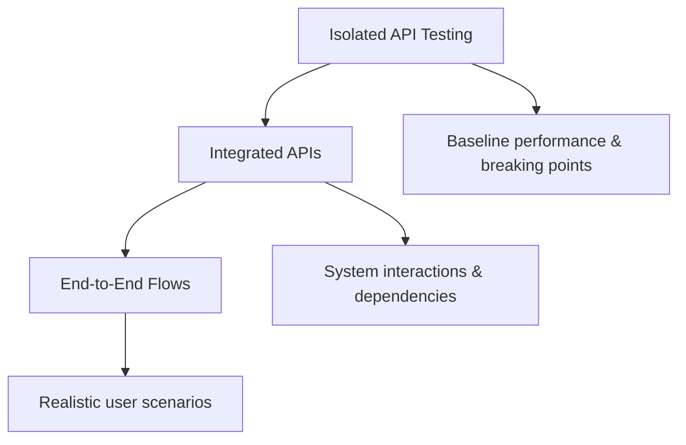

API load testing helps you understand how your backend services perform under various traffic conditions. This guide covers best practices for testing APIs with k6, from simple endpoint tests to complex end-to-end workflows.

## Planning Your API Tests

Before writing test scripts, consider three key questions:

<Steps>
  <Step title="What to test">
    Which flows or components do you want to test? Start with isolated endpoints, then progress to integrated APIs and end-to-end flows.
  </Step>
  
  <Step title="How to run">
    Will you test locally, in CI/CD, or from specific geographic locations? Consider where your load generators should be located.
  </Step>
  
  <Step title="Performance criteria">
    What determines acceptable performance? Define SLOs for latency, error rates, and throughput.
  </Step>
</Steps>

## Testing Strategy Progression

API testing typically follows the testing pyramid:



### 1. Isolated API Testing

Test individual endpoints to establish baseline performance:

```javascript
import http from 'k6/http';

export default function () {
  const payload = JSON.stringify({
    name: 'lorem',
    surname: 'ipsum',
  });
  const headers = { 'Content-Type': 'application/json' };
  http.post('https://quickpizza.grafana.com/api/post', payload, { headers });
}
```

### 2. Integrated API Testing

Test APIs that interact with other internal or external services:

```javascript
import http from 'k6/http';
import { check } from 'k6';

export default function () {
  // Create a resource
  const createRes = http.post('https://api.example.com/users', JSON.stringify({
    username: 'testuser',
    email: 'test@example.com',
  }), { headers: { 'Content-Type': 'application/json' } });
  
  check(createRes, { 'user created': (r) => r.status === 201 });
  
  // Retrieve the resource
  if (createRes.status === 201) {
    const userId = createRes.json('id');
    http.get(`https://api.example.com/users/${userId}`);
  }
}
```

### 3. End-to-End API Flows

Simulate complete user journeys across multiple endpoints:

```javascript
import http from 'k6/http';
import { check, sleep } from 'k6';

export default function () {
  // User authentication
  const loginRes = http.post('https://api.example.com/auth/login', 
    JSON.stringify({ username: 'user', password: 'pass' }));
  
  const token = loginRes.json('token');
  const headers = { 
    'Authorization': `Bearer ${token}`,
    'Content-Type': 'application/json'
  };
  
  // Browse products
  http.get('https://api.example.com/products', { headers });
  sleep(1);
  
  // Add to cart
  http.post('https://api.example.com/cart', 
    JSON.stringify({ productId: 123, quantity: 1 }), { headers });
  sleep(1);
  
  // Checkout
  http.post('https://api.example.com/checkout', 
    JSON.stringify({ cartId: 456 }), { headers });
}
```

## Modeling API Load

Choose the right load model based on your test goals:

### Virtual Users (Concurrent Users)

Use when simulating user behavior with think time:

```javascript
export const options = {
  vus: 50,
  duration: '30s',
};

export default function () {
  http.post('https://quickpizza.grafana.com/api/post', 
    JSON.stringify({ name: 'lorem', surname: 'ipsum' }),
    { headers: { 'Content-Type': 'application/json' } });
}
```

### Request Rate (Requests Per Second)

Use for throughput-based testing of isolated endpoints:

```javascript
export const options = {
  scenarios: {
    constant_rps: {
      executor: 'constant-arrival-rate',
      rate: 50,           // 50 iterations per timeUnit
      timeUnit: '1s',     // Per second
      duration: '30s',
      preAllocatedVUs: 50,
    },
  },
};

export default function () {
  http.post('https://quickpizza.grafana.com/api/post',
    JSON.stringify({ name: 'lorem', surname: 'ipsum' }),
    { headers: { 'Content-Type': 'application/json' } });
}
```

<Note>
**Calculating request rate:** If each iteration makes multiple requests, divide your target RPS by requests per iteration.

For 50 RPS with 2 requests per iteration: `rate = 50 / 2 = 25`
</Note>

## Validating Responses with Checks

Checks verify API correctness under load:

```javascript
import { check } from 'k6';
import http from 'k6/http';

export default function () {
  const payload = JSON.stringify({
    name: 'lorem',
    surname: 'ipsum',
  });
  const headers = { 'Content-Type': 'application/json' };
  const res = http.post('https://quickpizza.grafana.com/api/post', payload, { headers });

  check(res, {
    'status is 200': (r) => r.status === 200,
    'correct content type': (r) => r.headers['Content-Type'] === 'application/json',
    'response has name': (r) => r.status === 200 && r.json().name === 'lorem',
  });
}
```

<Tip>
Checks don't fail tests by default. Some failure rate is acceptable based on your SLOs. Use thresholds to define pass/fail criteria.
</Tip>

## Setting Performance Thresholds

Define SLOs as thresholds to validate reliability goals:

```javascript
export const options = {
  thresholds: {
    http_req_failed: ['rate<0.01'],    // HTTP errors < 1%
    http_req_duration: ['p(95)<200'],  // 95% of requests < 200ms
    http_req_duration: ['p(99)<500'],  // 99% of requests < 500ms
  },
  scenarios: {
    api_test: {
      executor: 'constant-arrival-rate',
      rate: 50,
      timeUnit: '1s',
      duration: '30s',
      preAllocatedVUs: 50,
    },
  },
};
```

<Warning>
When thresholds fail, k6 returns a non-zero exit code, which is essential for CI/CD automation.
</Warning>

## Advanced Scripting Patterns

### Data Parameterization

Use different data for each iteration:

```javascript
import http from 'k6/http';
import { SharedArray } from 'k6/data';

const users = new SharedArray('users', function () {
  return JSON.parse(open('./users.json')).users;
});

export default function () {
  const user = users[Math.floor(Math.random() * users.length)];
  
  const payload = JSON.stringify({
    name: user.username,
    surname: user.surname,
  });
  
  http.post('https://quickpizza.grafana.com/api/post', payload, {
    headers: { 'Content-Type': 'application/json' },
  });
}
```

### Error Handling

Handle API errors gracefully:

```javascript
import http from 'k6/http';
import { check } from 'k6';

export default function () {
  const createRes = http.post('https://api.example.com/resources',
    JSON.stringify({ data: 'value' }),
    { headers: { 'Content-Type': 'application/json' } });
  
  check(createRes, { 'created successfully': (r) => r.status === 201 });
  
  // Only proceed if creation succeeded
  if (createRes.status === 201) {
    const resourceId = createRes.json('id');
    http.delete(`https://api.example.com/resources/${resourceId}`);
  }
}
```

### Dynamic URL Grouping

Group similar endpoints to avoid metric explosion:

```javascript
import http from 'k6/http';

export default function () {
  const userId = Math.floor(Math.random() * 1000);
  
  // Use URL grouping for dynamic IDs
  http.get(`https://api.example.com/users/${userId}`, {
    tags: { name: 'GetUser' },
  });
}
```

## Testing Internal APIs

For APIs in restricted environments:

<CardGroup cols={2}>
  <Card title="Local Testing" icon="computer">
    Run k6 from your private network using the k6 CLI or Kubernetes operator
  </Card>
  <Card title="Cloud Testing" icon="cloud">
    Open firewall for k6 Cloud IPs or use private load zones in your Kubernetes clusters
  </Card>
</CardGroup>

## Integration with API Tools

### From Postman Collections

```bash
postman-to-k6 collection.json -o k6-script.js
k6 run k6-script.js
```

### From OpenAPI Specifications

```bash
openapi-generator-cli generate -i api-spec.json -g k6
k6 run k6-script.js
```

### From HAR Recordings

```bash
har-to-k6 archive.har -o k6-script.js
k6 run k6-script.js
```

<Note>
While converters help you get started quickly, learning the k6 JavaScript API enables more powerful and maintainable tests.
</Note>

## Beyond HTTP APIs

k6 supports multiple protocols:

<Tabs>
  <Tab title="HTTP/2">
    ```javascript
    import http from 'k6/http';
    http.get('https://api.example.com');
    ```
  </Tab>
  
  <Tab title="WebSockets">
    ```javascript
    import ws from 'k6/ws';
    
    export default function () {
      const url = 'wss://echo.websocket.org';
      ws.connect(url, function (socket) {
        socket.on('open', () => socket.send('ping'));
        socket.on('message', (msg) => console.log(msg));
      });
    }
    ```
  </Tab>
  
  <Tab title="gRPC">
    ```javascript
    import grpc from 'k6/net/grpc';
    import { check } from 'k6';
    
    const client = new grpc.Client();
    client.load(null, 'service.proto');
    
    export default function () {
      client.connect('grpc.example.com:443');
      
      const response = client.invoke('service.Method', { field: 'value' });
      
      check(response, {
        'status is OK': (r) => r && r.status === grpc.StatusOK,
      });
      
      client.close();
    }
    ```
  </Tab>
</Tabs>

## Complete Example

Here's a comprehensive API test with all best practices:

```javascript
import http from 'k6/http';
import { check, sleep } from 'k6';
import { SharedArray } from 'k6/data';

const users = new SharedArray('users', function () {
  return JSON.parse(open('./users.json')).users;
});

export const options = {
  stages: [
    { duration: '2m', target: 50 },  // Ramp up
    { duration: '5m', target: 50 },  // Steady state
    { duration: '2m', target: 0 },   // Ramp down
  ],
  thresholds: {
    http_req_failed: ['rate<0.01'],
    http_req_duration: ['p(95)<500'],
    'http_req_duration{endpoint:create}': ['p(99)<800'],
  },
};

export default function () {
  const user = users[Math.floor(Math.random() * users.length)];
  const headers = { 'Content-Type': 'application/json' };
  
  // Create resource
  const createRes = http.post(
    'https://api.example.com/resources',
    JSON.stringify({ name: user.username, data: user.data }),
    { headers, tags: { endpoint: 'create' } }
  );
  
  check(createRes, {
    'resource created': (r) => r.status === 201,
    'has resource id': (r) => r.json('id') !== undefined,
  });
  
  sleep(1);
  
  // Get resource if creation succeeded
  if (createRes.status === 201) {
    const resourceId = createRes.json('id');
    const getRes = http.get(
      `https://api.example.com/resources/${resourceId}`,
      { headers, tags: { endpoint: 'get' } }
    );
    
    check(getRes, {
      'resource retrieved': (r) => r.status === 200,
      'correct data': (r) => r.json('name') === user.username,
    });
  }
  
  sleep(1);
}
```

## Best Practices Summary

<Steps>
  <Step title="Start simple">
    Begin with isolated endpoint tests, then expand to integrated and end-to-end flows
  </Step>
  
  <Step title="Validate everything">
    Use checks to verify response status, headers, and payload correctness
  </Step>
  
  <Step title="Define SLOs">
    Set thresholds for error rates, latency percentiles, and custom metrics
  </Step>
  
  <Step title="Parameterize data">
    Use dynamic data to simulate realistic user behavior
  </Step>
  
  <Step title="Handle errors">
    Implement proper error handling to avoid cascading failures in tests
  </Step>
  
  <Step title="Modularize scripts">
    Create reusable modules for common scenarios to build a maintainable test suite
  </Step>
</Steps>
